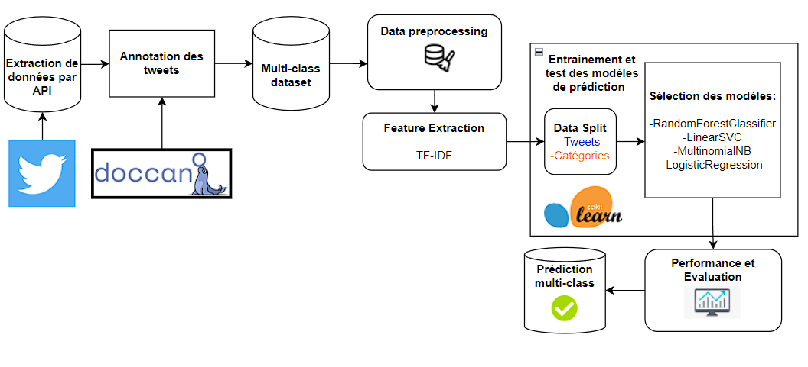
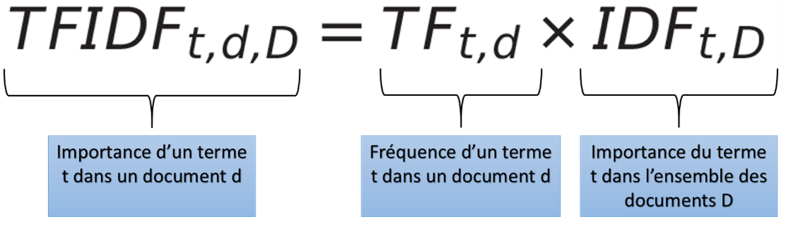
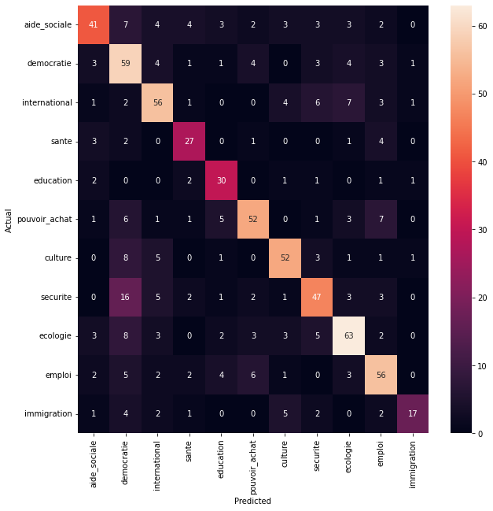
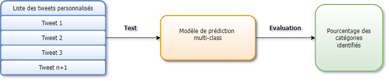

# Stage Data Scientist NLP au laboratoire de l'IDHN à Cergy Pontoise

## Introduction

L'IDHN (Institut des humanités numériques) est une structure fédérative en Humanités numériques (HN) qui a été créée en 2017 en lien avec le Domaine d'intérêt Majeur (DIM) Sciences du texte et connaissances nouvelles (STCN) porté par Paris Sorbonne Université et dont CY Cergy Paris Université est membre fondateur et partenaire. Elle regroupe des chercheurs de 4 laboratoires: « Lexiques, Textes, Discours, Dictionnaires » (LT2D), « Mobilités, Réseaux, Territoires, Environnement » (MRTE), Agora et « Équipes Traitement de l'Information et Systèmes » (ETIS), depuis 2017, et même avant par les collaborations entre les chercheurs de ces laboratoires, l’analyse des discours numériques a été au centre des préoccupations, en particulier en contexte électoral.

  

**Ma premier mission de ce stage est de créer d'un modèle d'apprentissage automatique avec des algorithmes NLP sur la classification de texte dans l'analyse des réseaux sociaux sur la campagne politique.**
*Contribution aux choix pertinents en matière d’analyse en temps réel de la campagne politique sur la plateforme web "Politique Quiz" (quiz politique basé sur les analyses de corpus et servira à visualiser un tableau de bord en temps réel de l’analyse des discours politique )*
**Ma deuxième mission en complément consiste à développer d'un algorithme de classification : méthode de Reinert en langage Go.**
**C'est un Algorithme de clustering simple pour visualiser le découpage d'un corpus en segments.**

## Procédure pour la classification multi-classes des tweets

L’étape de prétraitement des données est nécessaire pour effectuer un prétraitement du texte sur tous les tweets pour nettoyer les données textuelles et évaluer efficacement les performances du modèle appris. Et puis, nous devons convertir les données textuelles en données numériques en appliquant la méthode TF-IDF, pour indiquer l’importance des termes dans tous les tweets. 
Après la transformation des données, nous pouvons entraîner les modèles en séparant les données de tweets et les données de catégories en choisissant les différents modèles d’apprentissage par la méthode de validation croisée.
Enfin, après l’entraînement, nous pouvons analyser les performances du modèle de classification et choisir le modèle avec les meilleures performances prédictives.

  

## Data preprocessing : traitement des tweets et extraction de données TF-IDF  

En fait, les données textuelles ne sont pas structurées,  il est nécessaire de nettoyer les tweets. Nous choisirons les étapes de prétraitement en fonction de notre cas d’utilisation. Pour le cas de la classification des tweets, voici les différents types d’étapes de prétraitement que nous pouvons effectuer pour des données textuelles des tweets : 
•	Mettre toutes les données en minuscule 
•	Supprimer les ponctuations, des caractères spéciaux, des URL & hashtags
•	Supprimer les emojis et les émoticons 
•	Enlever les accents 
•	Supprimer les mots inutiles 
•	Supprimer les mots vides (stopwords) : Une liste contenant des mots les plus évidents mais dépourvus de sens (exemples mots vides : avec, pour, de, une, le)
•	Tokenisation : est un moyen pour séparer un morceau de texte en unités plus petits appelés « tokens »
•	Lemmatisation : effectue des traitements lexicaux notamment en regroupant les mots d’une même famille (exemple : l’adjectif « grand » existe sur quatre formes : grand, grande, grands et grandes) 

Le processus que nous allons utiliser s’appelle le TF-IDF (signifie en anglais Term Frequency - Inverse Document Frequency) une mesure qui permet de connaître l’importance relative de chaque mot à partir d’un ensemble de textes.

  

##  Evaluation de la performance du modèle 

Notre modèle sera évalué par le rapport de classification (classification report) qui est une mesure d’évaluation des performances sur l’apprentissage automatique et aussi par la matrice de confusion (confusion matrix), un outil pour aider à mesurer les performances du modèle. On observe que plus les valeurs diagonales de la matrice confusion sont élevées, mieux elles indiquent des prédictions correctes.

  

## 	Prédiction et Pourcentage des catégories identifiées

Pour déterminer le pourcentage de chaque catégorie, on doit compter le nombre des catégories qui sont identifiées et puis on fera la moyenne pour chaque catégorie

  

Voici 10 exemples de tweets personnalisés avec une liste des catégories. 

| Tweet personnalisé                                                                 | Prédiction de la catégorie |
|------------------------------------------------------------------------------------|----------------------------|
| Je veux réduire la pollution des CO2 ! #Environnement                              | Ecologie                   |
| Le mangaka Hajime Isayama a fait des succès ! #culturejaponais                     | Culture                    |
| Je veux augmenter les charges de travail pour toutes les entreprises ! #MarinePrésident | Emploi                |
| Il faut aider le peuple ukrainien à l’alimentation ! #social                       | Aide sociale               |
| On doit protéger les matières premières pour notre planète ! #YannickJadot         | Sécurité                   |
| Nous avons besoin plus de postes de travail aux entreprises pour les jeunes ! #MacronPrésident | Emploi         |
| Je veux lutter contre la déforestation. J’appelle à tous les Français se mobiliser ! | Ecologie                 |
| Limiter le réchauffement climatique ! Protégeons notre planète !                   | Ecologie                   |
| Nous voudrions augmenter le salaire pour les entreprises qui sont en crise sanitaire | Emploi                   |
| Association et mobilisation des peuples ukrainiens !                               | Aide sociale               |

A la fin j'ai obtenu la répartition des pourcentages pour chaque catégorie!
- 30% écolologie
- 10% culture
- 30% emploi
- 20% aide sociale
- 10% sécurité

